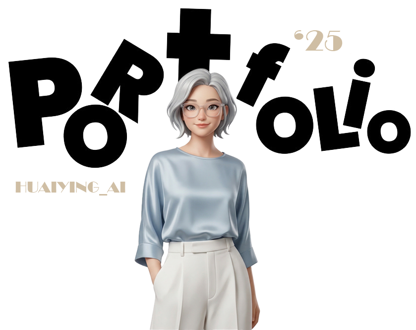

# AI 創作與效率工具包 | HY.studio (ai-treasure-library)



這是一個專為 AI 初學者設計的工具包網頁。如果你剛開始接觸 AI，這裡整理了幾個我每天都在用的 AI 工具，不需要寫程式、不需要設計背景就可以開始創作。AI 不只是關於技術，更要讓人感覺輕鬆自在。

🌐 **線上預覽網站**：[https://HuaiyingWang.github.io/ai-treasure-library/](https://HuaiyingWang.github.io/ai-treasure-library/)

## 🛠️ 包含的 AI 工具專案

1. **LINE 貼圖生成器**
   像抽卡一樣，隨機生成專屬 LINE 貼圖
2. **社群貼文圖片生成器**
   AI 自動排版配色，快速產出社群圖片
3. **社群貼文生成器 (Prompt)**
   把焦慮變成創作，一鍵生成完整的 Prompt

## ✨ 特色與亮點

- **零門檻上手**：不需程式背景，任何人都能使用
- **AI 驅動創作**：讓 AI 幫你完成排版、配色、設計
- **多元應用場景**：LINE 貼圖、社群貼文、Prompt 生成
- **完全免費**：所有工具皆可免費使用

## 📦 如何在本地端執行

1. 透過 Git Clone 下載此專案：
   ```bash
   git clone https://github.com/HuaiyingWang/ai-treasure-library.git
   ```
2. 開啟資料夾，直接點擊執行 `index.html` 即可在瀏覽器中預覽網頁。

## 🚀 網站更新規劃

若想要更新個人網站，請參考專案內的 [`更新網站步驟.md`](更新網站步驟.md)。

## 📝 更新紀錄 (Changelog)

### 最新更新：UI/UX 質感全面大升級 (UI UX Pro Max)
*   **視覺風格煥然一新**：從原先的深色科技感，徹底轉變為「極簡、乾淨、高信任度」的純淨淺色系 (Light Theme)。
*   **頂級 SaaS 卡片設計**：工具展示區捨棄傳統邊框與漸層，改用莫蘭迪純色背板搭配 **「3D 實體陰影」** 與 **「沉底疊加破格」** 的呈現手法，讓手機圖片立體地浮貼於畫面上。
*   **版面間距與佈局優化**：縮減了各區塊間的冗餘空白，全站結構更加精鍊緊湊，手機版與電腦版皆提供如原生 App 般的流暢閱讀體驗。

---

**Contact**
- ✉️ Email: love520297@gmail.com
- 📸 IG: [@huaiying_ai](https://www.instagram.com/huaiying_ai)

© 2025 AI 創作與效率工具包 | Powered by HY.studio
